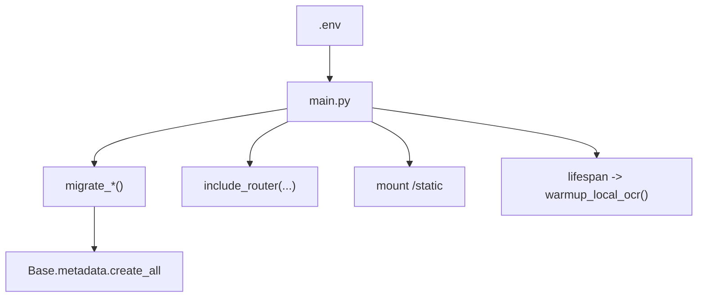
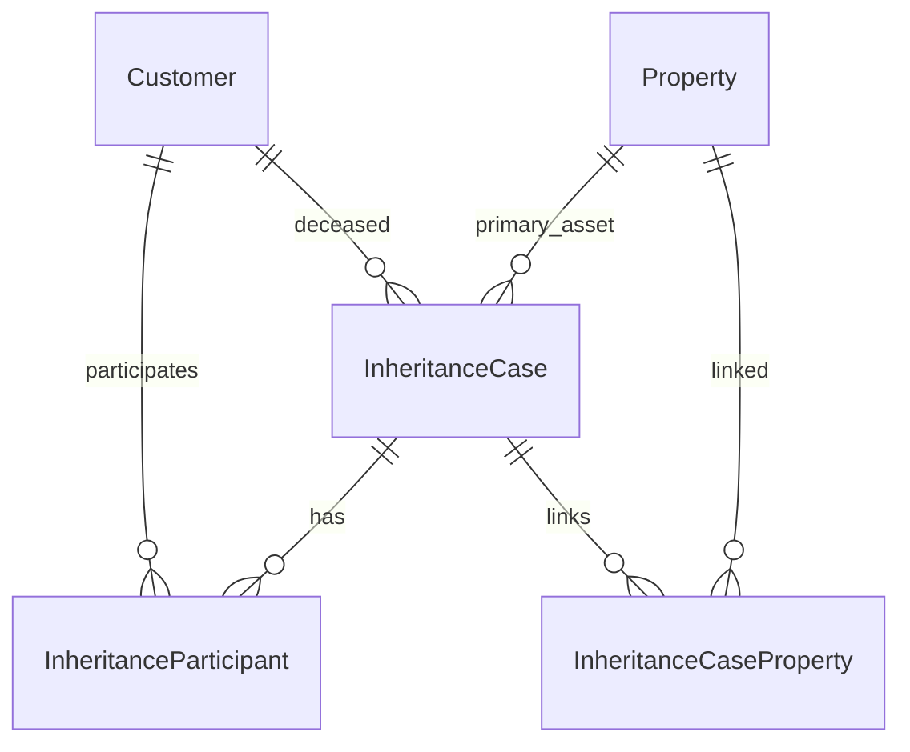
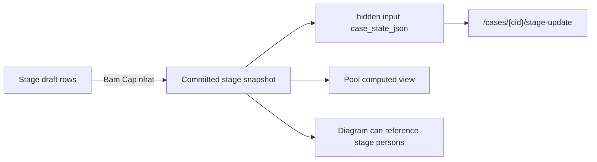
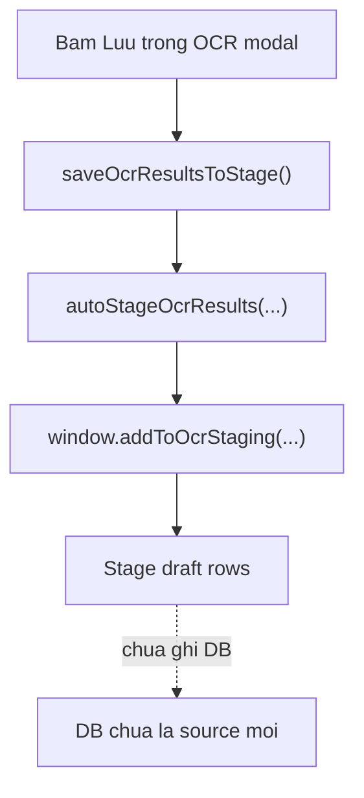
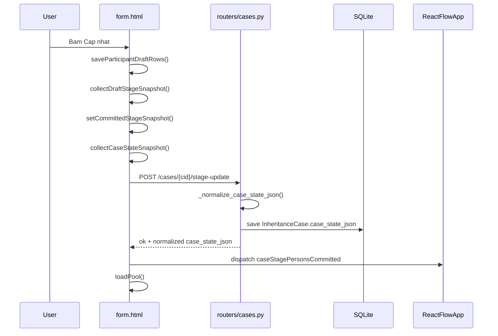
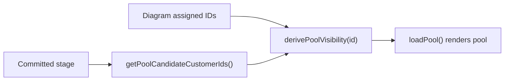
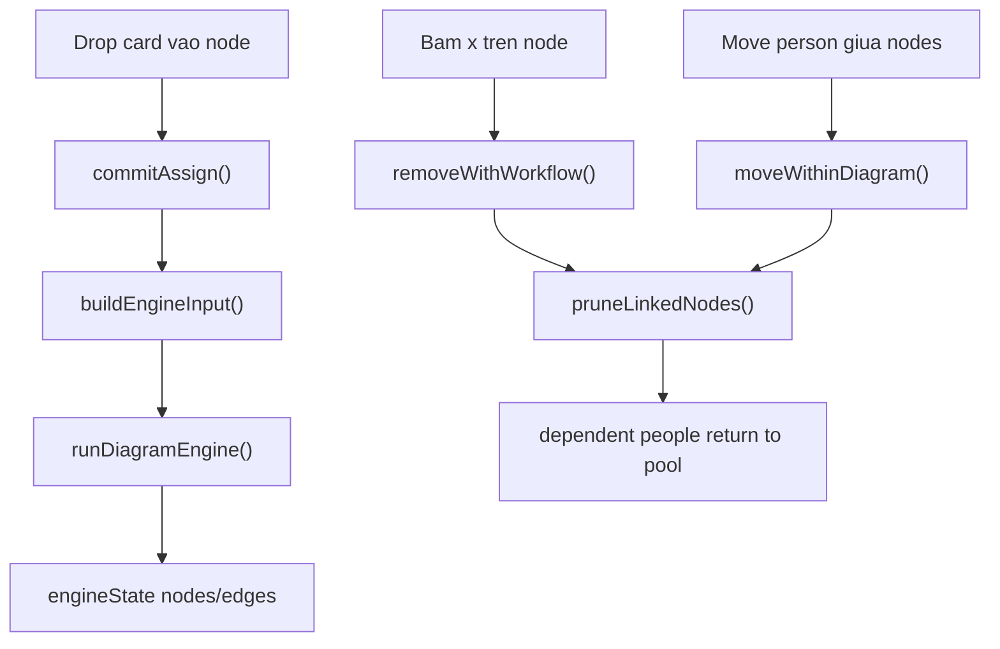

# Lo trinh hoc notary_v2 de dieu khien AI coding

Tai lieu nay danh cho nguoi khong can tu viet code, nhung can hieu du sau de ra lenh cho Codex/AI agent dung tang, dung scope va dung test trong du an `notary_v2`.

Muc tieu khong phai "hoc lap trinh co dien". Muc tieu la doc duoc plan, hieu duoc data dang nam o dau, hoi dung cau "ham nao goi ham nao", va bat agent chung minh bang direct output/test thay vi sua theo cam tinh.

## 1. Tu duy hoc dung cho AI coding

### 1.1 Hoc theo tang, khong hoc theo ngon ngu truoc

Khi ban mo ta mot loi, dung nghi ngay "sua code o dau". Hay ep bai toan di qua 6 tang:

1. UX: user bam nut nao, nhap gi, mong thay gi.
2. Data region: du lieu dang o OCR modal, stage draft, committed stage, pool, diagram, DB, hay Word output.
3. Function: nut do goi ham JavaScript/Python nao.
4. API: co goi endpoint nao khong, request payload gom field gi.
5. DB/state: field nao duoc ghi, vi du `case_state_json`, `engine_state_json`, `participants`.
6. Test: test nao khoa hanh vi do, hoac can them test nao.

Neu agent chua tra loi duoc 6 tang nay, chua nen sua code lon.

### 1.2 Nguon tham khao nen dung, va dung den muc nao

| Nguon | Lay gi | Khong can lay gi |
|---|---|---|
| CS50 | Tu duy input/output, function, condition, data structure, correctness | Khong can hoc het C/algorithm nang |
| Teach Yourself CS | Ban do lon de biet khai niem thuoc tang nao | Khong bien thanh lo trinh hoc nhieu nam |
| roadmap.sh Computer Science | Checklist khai niem | Khong hoc lan man ngoai du an |
| OpenAI prompting | Cach viet request ro goal, context, output format | Khong chi cham cham "prompt hay" ma bo qua repo truth |
| Claude Code / Cursor / Copilot best practices | Agent can context, scope, test, iteration nho | Khong de agent tu mo scope |

Cong thuc cho ban:

```text
Mot khai niem chi dang hoc neu no giup:
- doc plan cua agent tot hon,
- khoanh tang bug tot hon,
- viet prompt co scope/test tot hon,
- review code change cua agent tot hon.
```

## 2. Ban do repo toi thieu can thuoc

### 2.1 Entry points

| File | Vai tro | Khi nao doc |
|---|---|---|
| `AGENTS.md` | Rule, scope, verify, repo map | Dau moi turn hoac truoc khi giao task |
| `main.py` | Tao FastAPI app, migration, mount static, include router, warmup OCR | Khi app khong chay, route khong mount, startup loi |
| `database.py` | Engine, session, migration nhe | Khi schema/cot DB co van de |
| `models.py` | Dinh nghia bang DB | Khi can biet du lieu nao duoc luu that |
| `routers/cases.py` | Backend ho so, stage, diagram, Word | Khi bug lien quan ho so/stage/pool/diagram/export |
| `frontend/templates/cases/form.html` | UI lon nhat, OCR modal, stage, pool bridge, submit | Khi bug user bam nut tren form ho so |
| `frontend/static/ReactFlowApp.jsx` | Diagram ReactFlow va engine bridge | Khi bug keo tha/xoa/move/save diagram |
| `tests/cases_ui_dataflow_static.test.mjs` | Static test khoa invariant frontend | Khi sua flow stage/pool/diagram UI |
| `tests/test_diagram_payload_parser.py` | Backend test cho case_state/diagram save | Khi sua save/reload stage/diagram |

### 2.2 Model nao la du lieu gi

| Model | Hieu don gian | Luu o dau | Ghi chu |
|---|---|---|---|
| `Customer` | Mot nguoi: song/chet, CCCD, ngay sinh, dia chi | DB table `customers` | Du lieu danh ba goc |
| `Property` | Tai san/dat | DB table `properties` | Du lieu tai san goc |
| `InheritanceCase` | Ho so thua ke | DB table `inheritance_cases` | Trung tam cua case |
| `InheritanceParticipant` | Nguoi tham gia legacy/Word export | DB table `inheritance_participants` | Duoc derive tu diagram/state de tuong thich |
| `OCRJob` | Trang thai job OCR local async | DB table `ocr_jobs` | Khong phai du lieu case goc |
| `ExtractedDocument` | Ket qua OCR da xac nhan | DB table `extracted_documents` | Kho luu parse sau OCR |

Hai field quan trong cua `InheritanceCase`:

```text
case_state_json
- Source of truth V2 cho stage/pool/diagram.
- Gom stage va diagram.engineState.

engine_state_json
- State diagram legacy/compat.
- Van con duoc dong bo de tuong thich flow cu.
```

## 3. Lo trinh 4 tuan, 90 phut/ngay

Moi ngay dung format:

```text
15 phut: hoc khai niem
25 phut: doc code theo cau hoi
25 phut: ve flow/ham goi ham
15 phut: viet prompt cho Codex
10 phut: tu kiem tra bang checklist
```

### Tuan 1 - Nen tang doc code

#### Ngay 1 - File, module, function, import

Doc: `main.py`

Can tra loi:

- File nay tao app o dau? `app = FastAPI(...)`.
- App mount static o dau? `app.mount("/static", ...)`.
- Router nao duoc include? `customers`, `properties`, `cases`, `participants`, `ocr_ai`, `ocr_local`.
- Startup lam gi? load `.env`, migration, `create_all`, warmup local OCR.

So do:



Bai tap prompt:

```text
Hay giai thich app startup cua notary_v2 theo thu tu ham goi ham.
Chi dung main.py, database.py, AGENTS.md. Khong sua code.
Tra loi bang bang: buoc, ham/file, tac dung, loi co the gap.
```

#### Ngay 2 - Variable, object, list, dict, JSON

Doc: `models.py`

Can nam:

- `class Customer(Base)` la object Python dai dien bang DB.
- `Column(...)` la cot.
- `relationship(...)` la quan he giua bang.
- JSON trong du an co the la text luu DB, vi du `case_state_json`.

So do model toi thieu:



Bai tap:

Lap bang 4 cot:

```text
Model | Du lieu user thay tren UI | Field quan trong | Neu sai thi bug bieu hien the nao
```

#### Ngay 3 - Database, schema, migration

Doc: `database.py`, `models.py`, `routers/cases.py` phan `case_state_json`.

Can nam:

- Schema = cau truc bang/cot.
- Migration = cap nhat schema ma khong mat du lieu cu.
- DB session = phien lam viec voi DB, trong router thuong la `db: Session = Depends(get_db)`.

Prompt mau:

```text
Hay chi ra cac cot DB lien quan stage/pool/diagram.
Khong sua code. Giai thich field nao la source of truth, field nao legacy/compat.
```

#### Ngay 4 - Request, response, endpoint

Doc: `routers/cases.py:create`, `edit`, `update_stage`, `update_diagram`.

Can nam:

- Endpoint = URL + method, vi du `POST /cases/{cid}/stage-update`.
- Payload = du lieu gui len, vi du `case_state_json`.
- Response = JSON tra ve, vi du `{ "ok": true, "case_state_json": ... }`.
- Contract = frontend/backend da thoa thuan field nao co mat.

Bai tap:

Voi moi endpoint, tra loi 5 cau:

```text
1. Input la gi?
2. Output la gi?
3. Co ghi DB khong?
4. Loi tra ve kieu gi?
5. Test nao dang khoa hanh vi?
```

#### Ngay 5 - Frontend state

Doc: `frontend/templates/cases/form.html`

Can nam:

- Stage draft = row dang hien/sua tren UI.
- Committed stage = snapshot da bam `Cap nhat`.
- Hidden input `case_state_json` = cau noi UI -> backend.
- Pool khong phai data goc, pool duoc tinh tu committed stage tru diagram assignment.

So do:



#### Ngay 6 - Test la gi

Doc:

- `tests/cases_ui_dataflow_static.test.mjs`
- `tests/test_diagram_payload_parser.py`

Can nam:

- Static test co the chi doc text/source de khoa invariant.
- Backend unit test goi ham Python truc tiep.
- Regression test = test giu bug cu khong quay lai.

Prompt mau:

```text
Bug nay thuoc flow stage/pool/diagram.
Truoc khi sua, hay chi ra test hien co nao lien quan va neu chua co thi de xuat test regression cu the.
Khong sua code cho den khi co scope lock.
```

#### Ngay 7 - On tap: UX -> function -> API -> DB

Bai tap tong hop:

```text
User bam Cap nhat Stage.
Hay ve luong UX -> JS function -> JSON payload -> Python endpoint -> DB field -> UI event sau save.
```

## 4. Tuan 2 - Backend va API contract

### 4.1 Tu khoa can thuoc

| Tu | Hieu don gian trong notary_v2 |
|---|---|
| `router` | File gom endpoint cung nhom, vi du `routers/cases.py` |
| `endpoint` | URL server xu ly mot action |
| `payload` | Du lieu gui len/tra ve |
| `schema` | Cau truc field duoc phep co |
| `contract` | Thoa thuan frontend/backend ve payload/response |
| `validation` | Kiem tra payload hop le |
| `normalize` | Chuan hoa du lieu ve mot dang |
| `merge` | Gop state cu va state moi theo rule |

### 4.2 Ham backend can doc theo cum

Cum stage/diagram state:

```text
update_stage()
  -> _normalize_case_state_json()
  -> case.case_state_json = normalized
  -> db.commit()
```

Cum diagram save:

```text
update_diagram()
  -> _merge_case_state_diagram(existing_raw, submitted_raw)
  -> _case_state_payload(normalized_case_state)
  -> _normalize_diagram_payload(raw_payload)
  -> _parse_case_diagram_payload(...)
  -> _normalize_case_state_json(...)
  -> _replace_case_participants(...)
  -> db.commit()
```

Cum legacy derive:

```text
edit_form()
  -> _derive_case_state_json_from_participants(participants)
  -> render cases/form.html with case_state_json
```

### 4.3 Cach doc mot ham backend

Khi doc mot ham, khong doc tung dong truoc. Doc theo 7 cau:

```text
1. Ham nay duoc goi tu URL nao?
2. Input den tu Form, path, query, DB hay ham khac?
3. Ham goi helper nao?
4. Helper nao co quyen reject/raise error?
5. DB field nao bi thay doi?
6. Response tra ve field nao?
7. Test nao dang bao ve ham nay?
```

## 5. Tuan 3 - Stage / Pool / Diagram call map

Day la phan quan trong nhat vi no bien tu duy UX cua ban thanh ban do ky thuat.

### 5.1 Invariant can nho

```text
Stage = du lieu goc cua nguoi trong case.
Pool = view tinh tu committed stage tru nguoi da nam trong diagram.
Diagram = assignment + engineState + quan he/vi tri.
Diagram khong duoc xoa/sua stage.
Pool khong duoc tu quyet nguoi nao ton tai trong case.
```

### 5.2 OCR sang Stage

Call map:

```text
saveOcrResultsToStage()
  -> autoStageOcrResults({ allowMissingSides: true, allowDuplicates: true })
      -> window.addToOcrStaging(data, { source: 'ocr', skipDuplicateGuard: allowDuplicates })
```

Y nghia:

- OCR modal chi tao du lieu tam/draft.
- Bam `Luu` trong OCR dua ket qua xuong Stage draft.
- Chua phai committed stage neu user chua bam `Cap nhat`.

Mermaid:



### 5.3 Bam Cap nhat Stage

Call map:

```text
saveParticipantDraftRows(options)
  -> _collectDraftSnapshot(row)
  -> save/create customer rows as needed
  -> persistCommittedStageSnapshot({ latestEngineState, treeState })
      -> collectDraftStageSnapshot()
      -> setCommittedStageSnapshot(rows)
      -> collectCaseStateSnapshot(latestEngineState, treeState)
      -> fetch('/cases/{cid}/stage-update', { case_state_json })
      -> dispatch 'caseStagePersonsCommitted'
      -> loadPool()
```

Backend:

```text
update_stage(cid, case_state_json)
  -> _normalize_case_state_json(case_state_json)
  -> case.case_state_json = normalized
  -> db.commit()
  -> return { ok: true, case_state_json: normalized }
```

Mermaid:



Neu bug sau `Cap nhat`, hoi agent:

```text
Sai o draft row, committed stage snapshot, collectCaseStateSnapshot, endpoint update_stage, hay event caseStagePersonsCommitted?
Hay chung minh bang log/direct output cua tung tang.
```

### 5.4 Pool la computed view

Call map:

```text
loadPool()
  -> getPoolCandidateCustomerIds()
  -> derivePoolVisibility(customerId)
      -> getCommittedStageSnapshot()
      -> getDiagramAssignedStageIds()
```

Y nghia:

- Pool khong nen co source of truth rieng.
- Neu nguoi mat khoi pool, chua chac nguoi bi xoa. Co the do:
  - khong con trong committed stage,
  - dang duoc assign vao diagram,
  - `derivePoolVisibility()` sai,
  - reload/hydrate diagram sai.

Mermaid:



### 5.5 React diagram

Call map chinh:

```text
commitAssign(nodeId, rawPerson)
  -> validate target node
  -> materialize auto slot if needed
  -> assign person to node
  -> bridge workflow/pool updates

removeWithWorkflow(nodeId)
  -> collectRemovedPeople(...)
  -> pruneLinkedNodes(...)
  -> bridgeWorkflowUpdates(... inPool: true ...)

moveWithinDiagram(sourceNodeId, targetNodeId)
  -> collectRemovedPeople(sourceNodeId)
  -> move selected person
  -> prune dependent branch
  -> return dependent people to pool

handleStagePersonsCommitted(evt)
  -> read stageIds and removedIds
  -> collectRemovedPeople(...)
  -> pruneLinkedNodes(...)
  -> bridgeWorkflowUpdates(...)
```

Engine/save map:

```text
buildEngineInput(models)
  -> runDiagramEngine(models)
      -> returns engineState with nodes/edges/allocations/warnings
```

Mermaid:



### 5.6 Bam Luu so do

Frontend call map:

```text
case-form submit handler
  -> getDiagramApi()
  -> getFamilyTreeState()
  -> collectCaseStateSnapshot(latestEngineState, treeState)
  -> fetch('/cases/{cid}/diagram-update', {
       case_state_json,
       diagram_payload,
       engine_state_json
     })
```

Backend call map:

```text
update_diagram()
  -> _merge_case_state_diagram(case.case_state_json, submitted case_state_json)
  -> _case_state_payload(...)
  -> _normalize_diagram_payload(...)
  -> filter nodes outside stage / ghost / duplicate / orphan
  -> _parse_case_diagram_payload(...)
  -> recompute assignments from active nodes
  -> _normalize_case_state_json(...)
  -> _replace_case_participants(...)
  -> save case_state_json and engine_state_json
  -> return normalized payloads
```

Key rule:

```text
Luu so do khong commit draft stage.
Luu so do chi luu diagram state dua tren committed stage hien co.
```

## 6. Tuan 4 - Debug va dieu khien agent

### 6.1 Format debug bat buoc

Khi co bug, viet issue cho Codex theo format:

```text
BUG:
- User thao tac:
- Expected:
- Actual:
- Data dang o vung nao:
- Tang nghi ngo:
- File duoc doc:
- File duoc sua neu can:
- File khong duoc dung:
- Test bat buoc:
- Khong duoc doi:
```

Vi du:

```text
BUG:
- User thao tac: Xoa nguoi A khoi diagram bang nut x.
- Expected: A quay ve pool neu A van con trong committed stage.
- Actual: A bien mat khoi pool.
- Data dang o vung nao: committed stage van co A, diagram remove da xay ra, pool render sai.
- Tang nghi ngo: ReactFlow removeWithWorkflow / bridge workflow / derivePoolVisibility.
- File duoc doc: docs/case_user_flow_spec.md, frontend/static/ReactFlowApp.jsx, frontend/templates/cases/form.html.
- File duoc sua neu can: chi ReactFlowApp.jsx hoac form.html neu co bang chung.
- File khong duoc dung: routers/cases.py, models.py, OCR files.
- Test bat buoc: node --test tests/cases_ui_dataflow_static.test.mjs.
- Khong duoc doi: API contract, DB schema, OCR flow.
```

### 6.2 Cau lenh bat agent giai thich truoc khi sua

```text
Truoc khi sua code, hay tra loi:
1. Nut/UX nao kich hoat bug?
2. Function call chain hien tai la gi?
3. Data di qua nhung object/payload nao?
4. Tang nghi ngo sai la tang nao, vi sao?
5. Test nao se fail neu bug ton tai?
6. Scope lock de sua la gi?
```

### 6.3 Dau hieu plan cua agent nguy hiem

Can chan agent neu thay:

- Sua backend khi bug chi la UI mapping.
- Doi `case_state_json` schema khi chua co scope.
- Them fallback OCR cho AI OCR theo thoi quen.
- Gop OCR AI va OCR Local helper voi nhau.
- "Fix all related" nhung khong co file list.
- Khong noi test nao se chay.
- Dung tu "probably/should" thay vi direct output.
- Sua stage/pool/diagram nhung khong nhac invariant stage source of truth.

## 7. Cong cu truc quan nen dung

### 7.1 Trong Codex

| Cong cu | Dung de lam gi |
|---|---|
| `rg` | Tim function, endpoint, symbol nhanh |
| Mermaid | Ve flow trong docs/plan |
| Understand Anything plugin | Tao knowledge graph codebase, hoi "ham nay lien quan ham nao" |
| Codex browser/app | Xem docs, screenshot, dashboard neu co |

Prompt dung voi Understand Anything:

```text
Hay tao knowledge graph cho D:\notary_v2, uu tien module cases/stage/pool/diagram.
Sau do cho toi ban do lien ket giua form.html, ReactFlowApp.jsx va routers/cases.py.
```

### 7.2 Tool ngoai repo

| Tool | Dung cho | Lenh goi y |
|---|---|---|
| pydeps | Python module dependency | `pydeps routers --max-bacon 2 --show-deps` |
| pyan | Python call graph static | `pyan routers/cases.py --dot > cases_callgraph.dot` |
| Madge | JS dependency graph | `npx madge frontend/static --image js-deps.svg` |
| dependency-cruiser | JS dependency + rule | `npx depcruise frontend/static --output-type dot` |
| Emerge | Interactive dependency dashboard | Xem docs Emerge, dung khi can overview lon |
| Mermaid/C4 | So do co chu dich | Viet truc tiep trong `docs/learning/*.md` |

Luu y:

- Auto graph rat hay roi, nhung khong hieu nghiep vu.
- Mermaid thu cong cham hon, nhung rat tot de khoa invariant cho agent.
- Voi `notary_v2`, nen dung ca hai: auto graph de nhin lien ket file, Mermaid de giai thich flow user.

## 8. Bai tap mau theo muc do

### Bai 1 - Startup

De bai:

```text
Doc main.py va ve lai startup flow.
Chi ra neu Local OCR warmup fail thi app co dung khong.
```

Dap an mong muon:

- App van tao FastAPI.
- Warmup local OCR nam trong lifespan, co try/except.
- Fail warmup log warning/exception, khong lam app crash theo code hien tai.

### Bai 2 - Model map

De bai:

```text
Doc models.py. Phan loai cac model thanh:
- du lieu goc,
- state cua case,
- compat/export,
- job tam.
```

Dap an ngan:

```text
Du lieu goc: Customer, Property.
State case: InheritanceCase.case_state_json, engine_state_json.
Compat/export: InheritanceParticipant, WordTemplate.
Job tam: OCRJob, ExtractedDocument.
```

### Bai 3 - Cap nhat Stage

De bai:

```text
Viet lai flow Cap nhat Stage bang tieng Viet:
nut nao bam, ham nao chay, JSON nao gui, endpoint nao nhan, DB field nao doi.
```

Dap an phai co cac ten:

```text
saveParticipantDraftRows
_collectDraftSnapshot
persistCommittedStageSnapshot
collectCaseStateSnapshot
POST /cases/{cid}/stage-update
update_stage
_normalize_case_state_json
InheritanceCase.case_state_json
```

### Bai 4 - Bug nguoi xoa khoi diagram khong ve pool

Khoanh tang:

```text
1. ReactFlow remove: removeWithWorkflow()
2. Branch prune: collectRemovedPeople(), pruneLinkedNodes()
3. Workflow bridge: bridgeWorkflowUpdates()
4. Pool visibility: derivePoolVisibility()
5. Committed stage: getCommittedStageSnapshot()
6. Reload/save: update_diagram(), case_state_json.diagram
```

Prompt giao agent:

```text
Hay debug bug "remove khoi diagram khong ve pool".
Truoc khi sua, dung rg chi ra call chain removeWithWorkflow -> pool update.
Chi duoc sua tang co bang chung.
Khong doi schema, API contract, OCR flow.
Test bat buoc: node --test tests/cases_ui_dataflow_static.test.mjs.
```

### Bai 5 - Review plan cua agent

Checklist:

```text
- Plan co noi source of truth khong?
- Plan co file list khong?
- Plan co endpoint/payload lien quan khong?
- Plan co test cu the khong?
- Plan co noi khong doi contract/schema khong?
- Plan co nguy co sua nhieu tang cung luc khong?
```

## 9. Prompt templates de dung ngay

### 9.1 Yeu cau giai thich ham goi ham

```text
Hay giai thich flow <ten flow> trong notary_v2 theo call chain.
Bat dau tu UX/user action, roi den JS function, endpoint, Python helper, DB field, test lien quan.
Chi doc cac file theo AGENTS.md. Khong sua code.
Tra loi bang:
- Call chain
- Data payload
- Source of truth
- Diem de gay bug
- Test lien quan
```

### 9.2 Yeu cau sua bug co scope

```text
BUG:
<mo ta ngan>

EXPECTED:
<ket qua dung>

ACTUAL:
<ket qua sai>

SCOPE:
- Duoc doc:
- Duoc sua:
- Khong duoc sua:

CONTRACT:
- Khong doi API response/request.
- Khong doi DB schema.
- Khong doi OCR flow.

VERIFY:
- Chay <test cu the>.
- Neu task NORMAL/MAJOR va khong phai docs-only, chay .\verify.bat.

Truoc khi sua, in scope lock theo AGENTS.md va chi ra tang nghi ngo sai.
```

### 9.3 Yeu cau review code/plan

```text
Hay review theo stance code review:
- Findings truoc, sap theo severity.
- Dan file/line cu the.
- Tap trung bug, regression, scope violation, missing tests.
- Neu khong co issue, noi ro test gap con lai.
```

## 10. Tieu chi hoan thanh lo trinh

Ban dat muc tieu khi co the lam 5 viec nay:

1. Doc plan cua Codex va hieu cac tu: `payload`, `schema`, `contract`, `source of truth`, `normalize`, `merge`, `regression`, `invariant`.
2. Nhin bug UI va noi du lieu dang o OCR modal, stage draft, committed stage, pool, diagram, DB hay Word output.
3. Bat Codex tra loi "ham nao goi ham nao" truoc khi sua.
4. Yeu cau test dung tang, vi du static JS test cho UI invariant, Python unittest cho backend parser/save.
5. Giai thich flow stage/pool/diagram: stage la data goc, pool la computed view, diagram chi luu assignment/engineState/quan he/vi tri.

## 11. Mot cau than chu khi lam viec voi agent

```text
Dung sua code truoc. Hay noi ro:
- user action nao,
- data dang o dau,
- function call chain nao,
- source of truth nao,
- contract nao khong duoc doi,
- test nao chung minh dung.
```

Neu agent khong tra loi duoc, task chua du scope.
